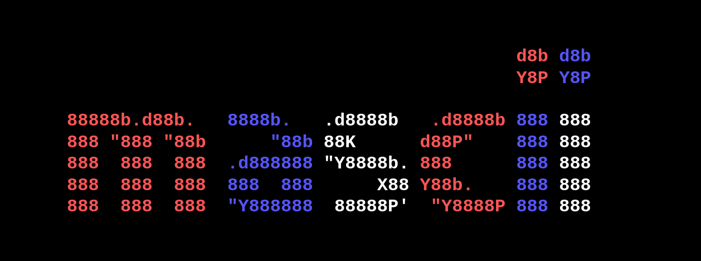

# mascii - Music that stays inside your workflow.


**mascii** isn’t just a music player, it’s a philosophy. It transforms your terminal into a sleek, high-performance audio station that respects your workflow. Whether you're coding, writing, or just vibing, mascii brings your library and the world of online streaming directly to your fingertips without the bloat.

---

## Why Choose mascii?

* **Focus, Not Clutter:** Stop switching windows. Everything you need-from playlist management to volume control-happens inside your terminal.
* **Universal Compatibility:** From high-fidelity local files to the latest track trending on YouTube, mascii plays it all effortlessly.
* **Professional Audio Control:** With a built-in equalizer and seamless shuffle/loop functions, you have complete command over your soundscape.
* **Ultra-Lightweight:** Built to run on minimal resources, leaving your CPU free to handle your real work.

---

## Installation & Setup

### Install via npm

```bash
npm install -g mascii
```

---

## Acknowledgements & Credits

* **Forward Kinematics Animations:** A huge thanks to **Tamilselvan R** ([@prtamil](https://github.com/prtamil)) for his incredible work on the core mechanics and graphics of the snake kinematics visualizer. This project integrates mathematical concepts and structures adapted from his open-source repository [AsciiCreativeCoding](https://github.com/prtamil/AsciiCreativeCoding).

---

## Controls

Inside the app:

- `Space` → Play / Pause
- `N` → Next track
- `P` → Previous track
- `Q` → Quit
- `S` → Shuffle
- `L` → Loop
- `+ / -` → Volume
- `E` → Equalizer
---
